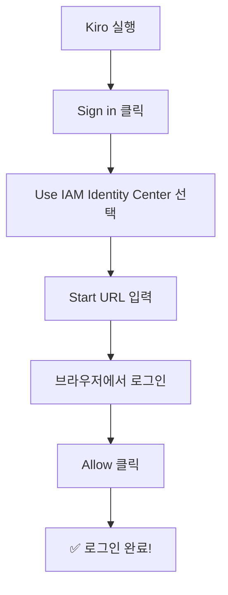
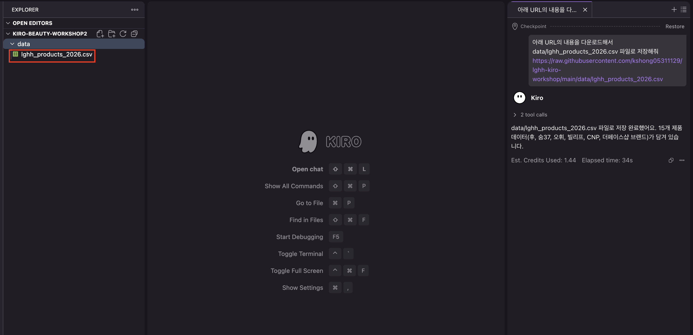

# 환경 설정

> ⏱️ 소요시간: 약 15분

## 📋 체크리스트

시작하기 전에 아래 항목을 확인하세요:

* [ ] 노트북 준비 (Windows 또는 Mac)
* [ ] 인터넷 연결 확인
* [ ] Kiro IDE 설치 완료
* [ ] 로그인 완료
* [ ] 실습 데이터 다운로드 완료

## Step 1: Kiro IDE 다운로드 🔧

### 다운로드 링크

👉 [https://kiro.dev/downloads](https://kiro.dev/downloads)

운영체제에 맞는 버전을 다운로드합니다:

* **Windows**: `.exe` 파일
* **Mac (Intel)**: `.dmg` 파일 (Intel)
* **Mac (Apple Silicon)**: `.dmg` 파일 (Apple Silicon)

> 💡 Mac 칩 확인법: 좌상단 🍎 → "이 Mac에 관하여" → 칩 확인

## Step 2: 설치하기

### Windows

1. 다운로드한 `.exe` 파일 더블클릭
2. "다음" 계속 클릭
3. 설치 완료!

### Mac

1. 다운로드한 `.dmg` 파일 더블클릭
2. Kiro 아이콘을 Applications 폴더로 드래그
3. Applications에서 Kiro 실행

> 💡 설치가 안 되면 손 들어주세요! 진행자가 도와드립니다. 🙋

## Step 3: 로그인 🔑

> ⚠️ **중요**: 오늘 워크샵은 **AWS IAM Identity Center** 방식(회사 SSO 계정)으로 로그인합니다. 개인 계정이 아닌, **워크샵 진행자가 안내하는 Start URL과 계정 정보**를 사용하세요.

1. Kiro를 실행합니다
2. **"Sign in"** 버튼 클릭
3. **"Use IAM Identity Center"** 선택
4. 진행자가 안내한 **Start URL**을 입력
5. 브라우저가 열리면 제공된 계정으로 로그인
6. \*\*"Allow"\*\*를 클릭하여 Kiro 접근을 허용



> ⚠️ **Start URL이나 계정 정보를 모르겠다면?** 진행자에게 바로 문의하세요. 워크샵 시작 전 미리 배포된 안내문을 확인해보세요.

## Step 4: 프로젝트 폴더 만들기 📁

1. 바탕화면에 `kiro-beauty-workshop` 폴더를 만듭니다
2. Kiro에서 **File → Open Folder** 클릭
3. 방금 만든 `kiro-beauty-workshop` 폴더 선택

## Step 5: 실습 데이터 준비 📄

오늘 워크샵에서 계속 사용할 데이터 2개를 미리 받아둡니다. Kiro AI 채팅창에 아래를 각각 입력하세요:

```
아래 URL의 내용을 다운로드해서 data/lghh_products_2026.csv 파일로 저장해줘
https://raw.githubusercontent.com/kshong05311129/lghh-kiro-workshop/main/data/lghh_products_2026.csv
```

<figure><figcaption></figcaption></figure>

```
아래 URL의 내용을 다운로드해서 data/beauty-brand-guide.md 파일로 저장해줘
https://raw.githubusercontent.com/kshong05311129/lghh-kiro-workshop/main/data/beauty-brand-guide.md
```

<figure><figcaption></figcaption></figure>

> 💡 CSV는 2026년 상반기 LG생활건강 가상 제품 데이터, 브랜드 가이드는 브랜드별 포지셔닝/톤앤매너 샘플 문서입니다. 이후 여러 모듈에서 반복해서 사용합니다.

## Step 6: 잘 되는지 확인하기 ✅

Kiro 화면에서 아래를 확인하세요:

* [ ] 왼쪽에 파일 탐색기가 보인다
* [ ] `data/` 폴더에 `lghh_products_2026.csv`, `beauty-brand-guide.md`가 보인다
* [ ] 오른쪽(또는 하단)에 AI 채팅창이 보인다

채팅창에 아래를 입력해보세요:

```
안녕하세요! 잘 작동하나요?
```

AI가 답변하면 성공입니다! 🎉

## 🔧 트러블슈팅

### "로그인이 안 돼요"

* Start URL을 정확히 입력했는지 확인
* 브라우저 팝업 차단이 되어있지 않은지 확인
* 진행자에게 계정 정보 재확인

### "Sign in 버튼이 안 보여요"

* Kiro를 완전히 종료 후 재실행해보세요

### "AI가 답변을 안 해요"

* 인터넷 연결 확인
* 로그인 상태 확인 (좌하단 계정 아이콘)

### "데이터 파일이 안 받아져요"

* 인터넷 연결 확인 후 다시 요청
* `data` 폴더가 없다면 "data 폴더 만들어줘"라고 먼저 요청

***

> 🎉 **준비 완료!** 이제 본격적으로 시작합시다!

👉 다음: [Module 1: Steering](../module1-steering/)
