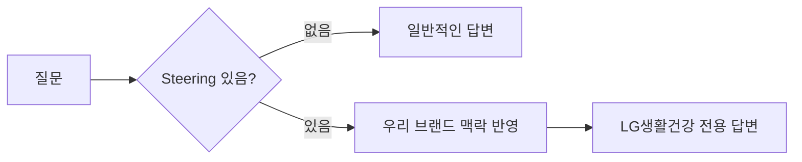

# Steering이란?

## 🤔 한마디로 설명하면

**Steering** = AI에게 주는 **"역할 설명서"**

AI는 똑똑하지만, 역할을 알려주지 않으면 **모든 것을 다 하려고** 합니다.

### Steering 없이 물어보면

```
"세럼 추천해줘"
```

→ AI: "일반적으로 비타민C 세럼이 좋습니다..." (너무 일반적!)

### Steering 있으면

```
"세럼 추천해줘"
```

→ AI: "LG생활건강 포트폴리오 기준으로, '후 비첩자생 에센스'는 한방 성분 기반의 안티에이징 세럼으로 40대 이상 타겟에 적합합니다. '숨37 시크릿 에센스'는 자연발효 컨셉으로 30대 초반 타겟에..." (훨씬 구체적!)



## 💡 비유로 이해하기

| 상황 | Steering 없는 AI | Steering 있는 AI |
|------|-----------------|-----------------|
| 비유 | 아무것도 모르는 인턴 | 업무 브리핑 받은 신입 BM |
| 답변 스타일 | 일반적, 교과서적 | 우리 회사 맥락에 맞는 답변 |
| 활용도 | "그냥 ChatGPT랑 뭐가 달라?" | "우리 팀 전용 AI 어시스턴트!" |

## 📍 Steering 파일 위치

Kiro에서 Steering은 프로젝트 내 특별한 위치에 저장됩니다:

```
내 프로젝트/
└── .kiro/
    └── steering/
        └── product.md     ← 이 파일!
```

## 📝 Steering 구성 요소

좋은 Steering에는 이런 내용이 들어갑니다:

| 요소 | 설명 | 예시 |
|------|------|------|
| 역할 | AI가 누구인지 | "너는 LG생활건강 뷰티 제품 전문가야" |
| 맥락 | 어떤 상황인지 | "한국 화장품 시장에서 일하고 있어" |
| 규칙 | 어떻게 행동해야 하는지 | "항상 한국어로, 데이터 기반으로 답변해" |
| 제한 | 하면 안 되는 것 | "추측으로 답변하지 마" |

## ✅ 핵심 정리

> 🎯 **Steering = AI에게 역할을 주는 것**
> 
> Steering이 잘 되어 있으면 → AI가 **우리 팀 전용 어시스턴트**처럼 동작합니다!

👉 다음: [Steering 작성하기](write-steering.md)
