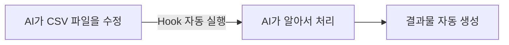
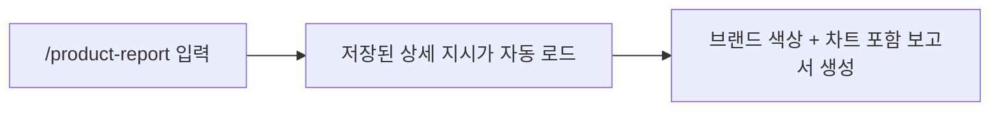

# Module 3: Hook & Skill

> ⏱️ 소요시간: 약 15분

## 🎯 이번 모듈의 목표

AI에게 **자동화 규칙**과 **단축 명령어**를 설정해서, 반복 작업을 줄여봅시다!

## 🤔 왜 필요할까?

Module 2에서 대화로 코딩하는 법을 배웠죠? 그런데 매번 같은 요청을 반복하면 귀찮습니다.

> 🧴 **뷰티 비유**
>
> 매주 월요일마다 팀장이 "이번 주 신제품 출시 현황 정리해줘, 브랜드별 매출 요약해줘, 경쟁사 동향 뽑아줘"라고 일일이 지시하면 비효율적이죠?
>
> * **Hook** = "새 제품 데이터가 업데이트되면 **자동으로** 브랜드별 분류해놔" (한 번 설정 → 매번 자동)
> * **Skill** = "제품분석" 한마디면 정해진 양식으로 뚝딱 (복잡한 지시를 한 단어로)

## 📌 Hook이란?

**특정 상황이 발생하면 AI가 자동으로 실행되는 규칙**입니다.

한 번 설정하면 매번 시키지 않아도 알아서 동작합니다.



> ⚠️ **중요**: Hook은 **AI(Kiro)가 파일을 만들거나 수정했을 때만** 자동 실행됩니다. 사람이 파일을 직접 열어서 타이핑하고 저장(`⌘+S`/`Ctrl+S`)하는 경우는 대상이 아닙니다 — Kiro의 설계상 동작 방식입니다. 그래서 아래 실습에서도 **CSV 수정은 AI에게 요청**합니다.

| 예시         | 트리거               | 자동 실행                  |
| ---------- | ----------------- | ---------------------- |
| 신제품 분류 자동화 | AI가 CSV 파일을 수정할 때 | 브랜드별 + 카테고리별 분류 리스트 생성 |
| 가격 이상 감지   | AI가 데이터를 변경할 때    | 경쟁사 대비 가격 이상치 알림       |
| 보고서 자동 갱신  | AI가 데이터를 업데이트할 때  | 차트 + 요약 자동 갱신          |

## 📌 Skill이란?

**자주 쓰는 복잡한 요청을 미리 저장해둔 단축 명령어**입니다.

매번 긴 프롬프트를 쓰는 대신, `/명령어` 한 번으로 실행할 수 있습니다.



| 비교    | Skill 없이                                        | Skill 있으면         |
| ----- | ----------------------------------------------- | ----------------- |
| 매번 입력 | "CSV 데이터 분석해서 브랜드별 매출, 카테고리별 비중, 월별 추이를 차트로..." | `/product-report` |
| 결과    | 매번 다를 수 있음                                      | 항상 일관된 양식         |

## 실습 준비: 데이터 확인 📄

이전 모듈에서 다운로드한 `data/lghh_products_2026.csv` 파일이 있는지 확인하세요.

없다면 채팅에 입력:

```
아래 URL의 내용을 다운로드해서 data/lghh_products_2026.csv 파일로 저장해줘
https://raw.githubusercontent.com/kshong05311129/lghh-kiro-workshop/main/data/lghh_products_2026.csv
```

## 실습 1: Skill 만들기 🎯

### Step 1: Skill 파일 생성

AI 채팅창에 입력하세요:

```
.kiro/skills/product-report 폴더를 만들고 SKILL.md 파일을 생성해줘.
내용은 아래와 같아:

---
name: product-report
description: 제품 CSV 데이터를 분석하여 제품 현황 보고서를 생성합니다. 매출 분석, 브랜드별 현황, 카테고리 통계가 필요할 때 사용합니다.
---

## 분석 규칙

1. data 폴더의 CSV 파일을 읽고 분석한다
2. 결과물은 단일 HTML 파일로 생성한다
3. CSV 데이터는 JavaScript 변수로 HTML 안에 직접 임베딩한다 (Python, Node.js 사용 금지)
4. Chart.js CDN을 사용하여 차트를 그린다
5. LG생활건강 브랜드 색상을 적용한다 (메인 #E4007F, 서브 #1B1B1B, 포인트 #C5A572)
6. 한국어로 작성한다
7. 다음 항목을 포함한다:
   - 브랜드별 제품 수 및 매출 비중 (도넛 차트)
   - 카테고리별 분포 (바 차트)
   - 가격대별 분포 (히스토그램)
   - 월별 출시 추이 (라인 차트)
   - 주요 수치 요약 (총 제품 수, 평균 가격, 브랜드 수)
```

<figure><figcaption></figcaption></figure>

### Step 2: Skill 사용해보기

이제 채팅에서 `/`를 입력하면 `product-report`가 보입니다. 선택하거나 직접 입력하세요:

```
/product-report
```

또는 자연어로:

```
이번 상반기 제품 현황 보고서 만들어줘
```

### Step 3: 결과 확인

생성된 HTML 파일을 브라우저에서 열면 차트가 포함된 보고서를 확인할 수 있습니다! 📊

> _product-report 실행 결과 대시보드_\
> <br>

<figure><figcaption></figcaption></figure>

## 실습 2: Hook 설정하기 ⚡

### Step 1: Hook 만들기

Kiro 왼쪽 패널에서 **Agent Hooks** 섹션을 찾아 **+** 버튼을 클릭합니다.

<figure><figcaption></figcaption></figure>

**"Ask Kiro to create a hook"** 을 선택하고 아래 내용을 입력하세요:

**"Ask Kiro to create a hook" 클릭하면 자동으로 아래 문구가 있습니다. 엔터치세요.**

<figure><figcaption></figcaption></figure>


```
data/lghh_products_2026.csv 파일이 AI에 의해 수정되면, 자동으로 신제품 검토 보고서를 new-product-review.html로 만들어줘.

보고서에 포함할 내용:
- 방금 추가/변경된 제품 정보 요약
- 같은 카테고리 기존 제품과 가격/타겟 비교 (겹치는 제품이 있으면 "타겟 중복 주의", 없으면 "차별화됨" 표시)
- data/beauty-brand-guide.md 기준 브랜드 톤앤매너 적합성 체크
- 검토 의견 한 줄 요약 (예: "프리미엄 라인 확장에 적합")

디자인은 카드가 아니라 정식 보고서 형태로 (제목/작성일자, 표 형식 데이터, 결론 섹션). LG생활건강 브랜드 컬러 사용, 인쇄해도 보기 좋게 만들어줘.
```

### Step 2: Hook 동작 확인

이제 Hook이 잘 동작하는지 확인해봅시다!

> 💡 위에서 설명했듯, Hook은 **AI가 파일을 수정할 때** 발동합니다. 그래서 CSV를 직접 열어서 고치지 말고, **채팅으로 AI에게 요청**해서 AI가 대신 수정하게 합니다.

채팅창에 아래를 입력하세요:

```
data/lghh_products_2026.csv 파일에 아래 제품 한 줄을 추가해줘:
후,천기단 자윤수,스킨,녹용/산삼,280000,2026-07,40대+여성,프리미엄
```

> 🎉 **AI가 CSV 파일을 수정하는 순간, Hook이 자동으로 발동해서 신제품 검토 보고서(`new-product-review.html`)를 생성합니다!**

이것이 Hook의 힘입니다. 한 번 설정하면 "CSV에 제품 추가해줘"라고 자연어로 요청할 때마다, 별도 지시 없이도 검토 보고서가 자동으로 따라 나옵니다. 실무에서라면 "신제품 등록 → 검토 보고서 자동 생성"이 되는 셈이죠.

> 📸 _스크린샷 삽입: AI에게 CSV 추가 요청 → Hook 자동 실행으로 생성된 검토 보고서_

## 💡 Hook vs Skill 정리

| 구분     | Hook              | Skill              |
| ------ | ----------------- | ------------------ |
| 실행 방식  | **자동** (이벤트 발생 시) | **수동** (`/명령어` 입력) |
| 설정     | "\~하면 \~해줘"       | 복잡한 지시를 미리 저장      |
| 뷰티 비유  | "신제품 등록되면 자동 분류"  | "제품보고서" 한마디로 끝     |
| 적합한 상황 | 매번 반복되는 자동화       | 복잡하지만 자주 쓰는 작업     |

## ✅ 완료 체크리스트

* [ ] Skill 파일을 생성했다
* [ ] `/product-report`로 보고서를 만들어봤다
* [ ] Hook을 설정했다
* [ ] AI에게 CSV 추가를 요청해서 Hook이 자동 실행되는 것을 확인했다

## 🔧 트러블슈팅

### "Skill이 `/` 목록에 안 보여요"

* `.kiro/skills/product-report/SKILL.md` 경로가 맞는지 확인
* 파일을 저장한 후 잠시 기다려보세요

### "Hook이 자동 실행되지 않아요"

* Agent Hooks 패널에서 Hook이 활성화(enabled) 상태인지 확인
* 파일 패턴(CSV)이 맞는지 확인
* **CSV 파일을 직접 열어서 타이핑하고 저장하지 않았는지 확인** — Hook은 AI가 파일을 수정할 때만 발동합니다. 사람이 에디터에서 직접 저장한 경우는 대상이 아닙니다. "CSV에 \~한 줄 추가해줘"처럼 채팅으로 AI에게 요청하세요.

### "차트가 안 보여요"

* 인터넷 연결 확인 (Chart.js를 CDN에서 불러옵니다)
* 브라우저에서 HTML 파일을 열었는지 확인

***

> 🎉 **축하합니다!** 이제 AI를 자동화하고 단축 명령으로 활용하는 방법을 배웠습니다!

👉 다음: [Module 4: Spec 기반 개발](../module3-spec/)
