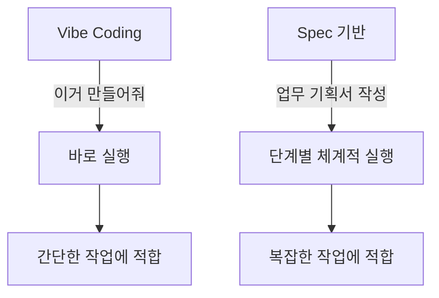

# Module 4: Spec 기반 개발

> ⏱️ 소요시간: 약 30분

## 🎯 이번 모듈의 목표

**Spec(설계서)**을 작성하고, AI가 체계적으로 실행하게 만들어봅니다!

### 뷰티 업계로 비유하면...

> **Vibe Coding** = 팀장이 구두로 지시 → BM이 바로 실행
> **Spec 기반** = 팀장이 업무 기획서 작성 → BM이 단계별로 실행

### 언제 Spec을 쓸까?

| 상황 | 방법 |
|------|------|
| 간단한 수정 | Vibe Coding (대화) |
| 새로운 기능 1개 | Vibe Coding (대화) |
| 여러 기능이 있는 도구 | **Spec 기반** ✅ |
| 복잡한 로직 | **Spec 기반** ✅ |

## 📋 학습 순서

| 단계 | 내용 | 설명 |
|------|------|------|
| 1️⃣ | [Spec 작성하기](write-spec.md) | 설계서 만들기 |
| 2️⃣ | [Task 실행하기](run-tasks.md) | AI가 단계별 실행 |

## ✅ 완료 체크리스트

이 모듈을 마치면:
- [ ] Spec이 무엇인지 이해한다
- [ ] Kiro에서 Spec을 작성할 수 있다
- [ ] Task를 실행하여 결과물을 만들 수 있다

👉 시작: [Spec 작성하기](write-spec.md)
