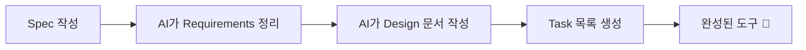
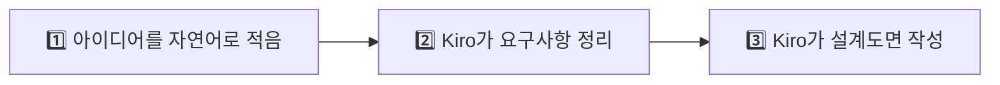

# Spec 작성하기

> 🎯 경쟁사 비교 분석 도구의 설계서(Spec)를 작성해봅시다!

## Spec이란?

**Spec** = AI에게 주는 **체계적인 업무 지시서**

Vibe Coding과의 차이:

| 비교 | Vibe Coding | Spec |
|------|-------------|------|
| 방식 | "이거 만들어줘" (한 번에) | "이런 순서로, 이렇게 만들어줘" (단계별) |
| 적합한 상황 | 간단한 도구 | 여러 기능이 있는 복합 도구 |
| 결과물 관리 | AI 재량 | 내가 구조를 결정 |



## 오늘 만들 것: 경쟁사 비교 분석 도구

기능:
1. 자사 제품 정보 입력
2. 경쟁사 제품 정보 입력 (최대 3개)
3. 비교 테이블 자동 생성
4. 차별화 포인트 하이라이트
5. PDF/이미지 내보내기

## Step 1: Spec 생성하기

Kiro의 **Spec 패널**을 열어봅시다:

1. 왼쪽 사이드바에서 Spec(설계) 아이콘을 클릭 (또는 상단 메뉴에서 진입)
2. **"+ Create New Spec"** 클릭
3. 아래 내용을 입력 후 엔터

```
경쟁사 비교 분석 도구를 만들고 싶어. Spec을 작성해줘.

기능 요구사항:
1. 자사 제품 정보 입력 (브랜드, 제품명, 카테고리, 핵심성분, 가격, USP)
2. 경쟁사 제품 정보 입력 (최대 3개, 같은 항목)
3. "비교 분석" 버튼 클릭 시:
   - 항목별 비교 테이블 생성
   - 가격 비교 바 차트
   - 자사 우위 항목 초록색 하이라이트
   - 경쟁사 우위 항목 빨간색 하이라이트
4. 결과를 이미지로 저장 가능

기술 조건:
- 단일 HTML 파일
- Chart.js CDN, Tailwind CSS CDN, html2canvas CDN 사용
- 별도 설치 없이 브라우저에서 실행
- 한국어 UI
- 파일명: competitor-analysis.html
```

4. 오른쪽 패널에 "Input required"가 뜨면 **Build a Feature**를 선택하고 **Submit answer** 클릭
5. 이어서 "Input required"가 다시 뜨면 **Requirements**를 선택하고 **Submit answer** 클릭

> 📸 *스크린샷 삽입: Spec 생성 요청 및 Input required 화면*

> 💡 화면 구성은 Kiro 버전에 따라 문구가 조금 다를 수 있습니다. 진행자 화면을 참고하세요.

## Step 2: AI가 생성한 Requirements 확인 👀

AI가 여러분의 요청을 분석해서 **구조화된 요구사항 문서**를 만들어줍니다:

```markdown
## Requirements
- 자사/경쟁사 제품 입력 폼
- 항목별 비교 테이블
- 가격 비교 차트
- 우위 항목 하이라이트
- 이미지 저장 기능
```

Spec 파일은 `.kiro/specs/` 폴더에 저장됩니다:

```
.kiro/specs/competitor-analysis/
├── requirements.md   ← 요구사항 정의서
├── design.md          ← 설계 문서 (Step 3에서 생성)
└── tasks.md           ← 실행 계획 (단계별 작업 목록)
```

> 📸 *스크린샷 삽입: 생성된 Requirements 문서*

## Step 3: Requirements 수정하기 ✏️

생성된 내용을 보고 수정하고 싶은 부분이 있으면:

```
Requirements에 다음 내용을 추가해줘:
- 비교 항목이 3개 이상일 때 가로 스크롤 지원
- 각 제품 카드에 "포지셔닝 요약" 한 줄 추가
```

## Step 4: Design 문서 생성하기 📐

Requirements가 만족스러우면 **Design** 단계로 넘어갑니다.

화면 상단의 **→ Continue** 버튼을 클릭하고 **Generate Design** 항목을 선택하세요.

Kiro가 Requirements를 바탕으로 **설계 문서(Design)**를 자동 생성합니다:

| 설계 항목 | 쉽게 말하면 |
|---|---|
| 🖥️ 화면 레이아웃 구성 | 어떤 화면이 어디에 배치되는지 |
| 🔗 화면 간 연결 구조 | 어떤 버튼을 누르면 무슨 일이 일어나는지 |
| 📊 데이터 흐름 | 입력한 정보가 어떻게 처리되는지 |

> ⚠️ **참고**: Design 문서에 영어가 많이 보여도 당황하지 마세요! 개발자를 위한 설계도이기 때문에 영어가 섞이는 것이 정상입니다.

> 📸 *스크린샷 삽입: Design 문서 및 Task 목록*

Design까지 승인되면 `tasks.md`에 이런 식으로 실행 계획이 생깁니다:

```markdown
## Tasks

- [ ] Task 1: HTML 기본 구조 및 레이아웃 생성
- [ ] Task 2: 자사 제품 입력 폼 구현
- [ ] Task 3: 경쟁사 제품 입력 폼 구현 (동적 추가/삭제)
- [ ] Task 4: 비교 분석 로직 및 테이블 생성
- [ ] Task 5: Chart.js 가격 비교 차트 구현
- [ ] Task 6: 우위 항목 하이라이트 로직
- [ ] Task 7: 이미지 저장 기능 (html2canvas)
```

## 🎉 여기까지가 Spec 체험입니다!

여러분은 방금 이런 일을 했습니다:



> ✅ **대단해요!**
> 여러분은 방금 **전문 기획자가 며칠 걸려 하는 일**을 10분 만에 체험했습니다! 🎊
>
> 실제 프로젝트에서는 이 설계도를 바탕으로 **코드를 자동 생성하는 단계**까지 진행할 수 있습니다.

## 💡 좋은 Spec 작성 팁

| 포함할 것 | 예시 |
|---|---|
| 기능 목록 | "입력, 비교, 하이라이트, 저장" |
| 디자인 요구 | "LG생활건강 브랜드 컬러, 모바일 대응" |
| 데이터 소스 | "data/lghh_products_2026.csv 참고" |
| 예외 처리 | "입력값이 비어있을 때 안내 메시지" |

## ✅ 체크리스트

- [ ] Spec 생성 요청 완료
- [ ] `.kiro/specs/` 폴더에 파일 생성 확인
- [ ] Requirements 내용 확인 및 수정
- [ ] Design 문서 생성 확인

> 💡 **핵심**: Spec은 AI와 내가 "합의한 설계서"입니다. Task를 실행하기 전에 내용을 확인하고, 원하는 대로 수정할 수 있습니다!

## ⚖️ 바이브 코딩 vs Spec 비교

| | 🗣️ 바이브 코딩 (Module 2) | 📐 Spec (Module 4) |
|---|---|---|
| **과정** | 채팅으로 바로 코드 생성 | 요구사항 → 설계 → (코드 생성) |
| **느낌** | "일단 만들어봐!" 🏃 | "계획부터 세우자" 📋 |
| **언제 좋을까** | 빠르게 프로토타입 만들 때 | 제대로 된 도구를 만들 때 |

두 방식을 **섞어 쓸 수도 있습니다!** 💡
예: Spec으로 큰 틀을 잡고 → 세부 조정은 바이브 코딩으로.

---

## 🚀 더 해보고 싶다면? (보너스)

> 💡 **시간이 남거나 호기심이 있으신 분!**
> 지금까지 만든 Requirements + Design을 바탕으로 **실제로 코드를 자동 생성**하는 것까지 해볼 수 있습니다.
> 다만 Task 실행은 15~20분 이상 걸릴 수 있어서, 워크샵 중에는 선택 사항입니다.
>
> 👉 [🚀 (보너스) Task 실행하기](run-tasks.md)

---

> 🎉 **축하합니다!** Module 4를 완료했습니다! Spec으로 체계적인 개발을 경험했어요!

👉 다음: [Module 5: 자유 실습](../module4-challenge/README.md)
