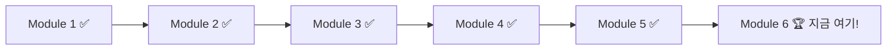

# Module 6: 자유 실습

> ⏱️ 소요시간: 약 50분 (실습 30분 + 발표 20분)

## 🎯 이번 모듈의 목표

지금까지 배운 것을 활용해서 **나만의 뷰티 도구**를 만들어봅시다!

## 🎉 여기까지 오신 여러분, 대단합니다!

여러분은 이미:
- ✅ AI에게 역할을 부여하는 법 (Steering)
- ✅ 대화로 코딩하는 법 (Vibe Coding)
- ✅ 자동화와 단축 명령 (Hook & Skill)
- ✅ 체계적으로 설계하는 법 (Spec)
- ✅ 외부 도구 연결하는 법 (MCP)

을 모두 배웠습니다! 이제 **자유롭게** 만들어보세요! 🚀

## 📋 실습 방법

1. 아래 주제 중 **하나를 선택** (또는 자유 주제!)
2. Module 2 방식(Vibe Coding)으로 진행 — Module 4 방식(Spec)은 Requirements/Design부터 짜야 해서 30분 안에는 시간이 부족합니다
3. 30분 동안 자유롭게 만들기
4. 이어서 20분 동안 발표 시간 (아래 참고)

## 🎯 추천 주제

| # | 주제 | 난이도 | 설명 |
|---|------|--------|------|
| 1 | 마케팅 카피 생성기 | ⭐ | 제품 특징 입력 → SNS/광고 카피 자동 생성 |
| 2 | 타겟 고객 페르소나 카드 | ⭐⭐ | 연령/라이프스타일 입력 → 페르소나 카드 생성 |
| 3 | 제품 런칭 타임라인 | ⭐⭐ | 일정 입력 → 간트차트 HTML 생성 |
| 4 | 성분 비교 분석기 | ⭐⭐ | 제품 성분 입력 → 비교 인포그래픽 |
| 5 | NPL 보고서 요약기 | ⭐⭐⭐ | 제품 정보 입력 → Strategic Fit 요약 자동 생성 |
| 6 | 브랜드 가이드 검색 도우미 | ⭐⭐ | "표현 가이드라인 뭐였지?" → 브랜드 가이드에서 바로 검색 |
| 7 | 뷰티 유형 테스트 | ⭐ | 질문 몇 개에 답하면 "나는 어떤 스킨케어 유형"인지 결과 카드 생성 |
| 8 | 오늘의 뷰티 운세 | ⭐ | 오늘 날짜/기분 입력 → 오늘의 추천 컬러·제품·루틴을 운세처럼 생성 |
| 9 | 향수 조합 이름 짓기 | ⭐ | 좋아하는 향/느낌 입력 → 그럴듯한 향수 이름 + 감성 카피 생성 |
| 10 | 레트로 광고 포스터 생성기 | ⭐⭐ | 제품 정보 입력 → 빈티지 느낌 광고 포스터 스타일 HTML 생성 |
| 11 | 기분 컬러 매칭기 | ⭐ | 오늘 기분/날씨 입력 → 어울리는 립/네일 컬러 추천 |

> 💡 난이도가 낮은 것부터 시작하는 것을 추천합니다!

👉 [주제별 상세 가이드 보기](topics.md)

## 🎤 발표 (20분)

30분간 만든 결과물을 다 같이 공유하는 시간입니다. 전원 발표는 시간상 어려우니, 자원자 4~5명만 받습니다.

**발표 포인트 (공통 가이드)**
1. 무엇을 만들었는지 한 줄 소개
2. 어떤 프롬프트/지시가 특히 잘 먹혔는지
3. 아쉬웠던 점이나 다음에 시도해보고 싶은 것
