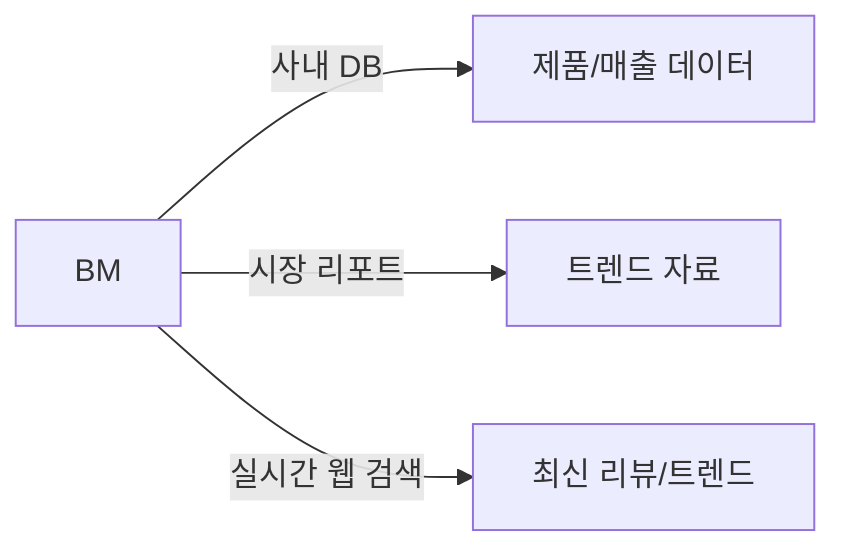
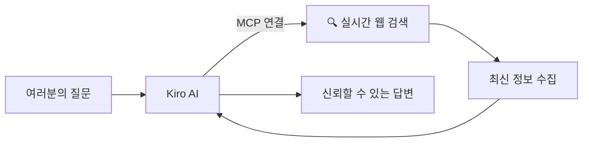

# Module 6: MCP 연동

> ⏱️ 소요시간: 약 20분

## 🎯 이번 모듈의 목표

AI에게 **외부 도구를 연결**해서 더 강력하게 만들어봅시다!

## 🤔 MCP란?

**MCP (Model Context Protocol)** = AI에게 새로운 능력을 부여하는 방법

### 뷰티 업계로 비유하면

> BM이 아무리 뛰어나도, **시장 리서치 DB나 최신 트렌드 리포트에 접근 못하면** 경쟁사 분석도, 시장 트렌드 파악도 제한적이죠.

MCP는 AI에게 **외부 자료에 직접 접근할 수 있는 권한을 주는 것**과 같습니다!

## 📱 MCP 없는 AI vs MCP 있는 AI

| 상황 | MCP 없음 | MCP 있음 |
|------|---------|---------|
| "설화수 자음생 에센스 최신 리뷰 알려줘" | 학습된 옛날 정보만 답변 | **실시간 웹 검색**해서 최신 후기 확인 |
| "요즘 뜨는 K-beauty 성분 트렌드는?" | 기억에 의존한 부정확한 답변 | **최신 검색 결과 기반** 답변 |
| "경쟁 브랜드 신제품 반응 어때?" | 오래된 정보일 수 있음 | **실시간 정보** 기반 정확한 답변 |

## 🔌 오늘 연결할 MCP: 웹 검색

오늘은 **웹 검색 MCP**를 연결해서 AI가 실시간으로 인터넷을 검색할 수 있게 만들겠습니다.

**활용 예시:**
- 🔍 경쟁사 제품 최신 리뷰/반응을 실시간으로 확인
- 📈 K-beauty 트렌드 키워드를 AI가 대신 찾아서 요약
- ✅ 학습된 정보가 아닌 실제 최신 웹 정보 기반 답변

## 📋 이번 모듈 순서

| 단계 | 내용 | 설명 |
|------|------|------|
| 1️⃣ | [MCP 설정하기](setup-mcp.md) | 웹 검색 MCP 연결 (5분) |
| 2️⃣ | [MCP 활용 실습](mcp-practice.md) | MCP 연결 전후 차이 체험 (15분) |

> 💡 **핵심 포인트**: MCP를 연결하면 AI가 "더 많이 아는 것"이 아니라, "외부 지식에 직접 접근할 수 있는 것"이 됩니다!

👉 다음: [MCP 설정하기](setup-mcp.md)
