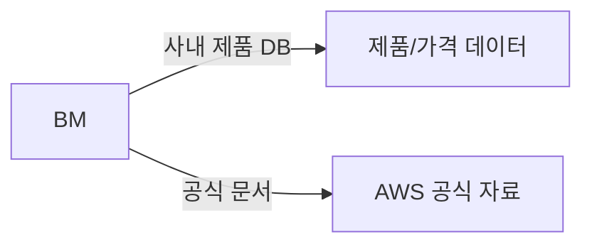
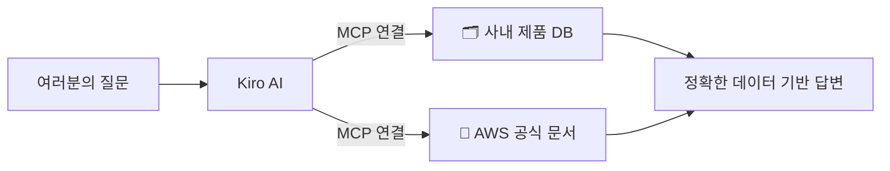

# Module 6: MCP 연동

> ⏱️ 소요시간: 약 20분

## 🎯 이번 모듈의 목표

AI에게 **외부 도구를 연결**해서 더 강력하게 만들어봅시다!

## 🤔 MCP란?

**MCP (Model Context Protocol)** = AI에게 새로운 능력을 부여하는 방법

> 💡 Kiro는 이미 자체적으로 웹 검색이 가능합니다. 그래서 오늘은 "웹 검색" 대신, **Kiro가 원래 절대 알 수 없는 것 두 가지**를 MCP로 연결해봅니다.

### 뷰티 업계로 비유하면

> BM이 아무리 뛰어나도, **회사 밖 공식 자료나 사내 DB에 접근 못하면** 정확한 판단도, 데이터 기반 분석도 제한적이죠.

MCP는 AI에게 **AI 혼자서는 닿을 수 없는 자료에 직접 접근할 수 있는 권한을 주는 것**과 같습니다!

## 📱 MCP 없는 AI vs MCP 있는 AI

| 상황 | MCP 없음 | MCP 있음 |
|------|---------|---------|
| "우리 제품 DB에서 브랜드별 평균가 알려줘" | AI는 우리 회사 DB 자체를 모름 → 답변 불가 | **실제 DB를 조회**해서 정확한 숫자로 답변 |
| "AWS 최신 공식 문서 기준으로 알려줘" | 학습 시점 기준의 부정확한 답변일 수 있음 | **공식 문서 원문**을 찾아서 답변 |
| "신제품 가격 포지셔닝, 우리 데이터 기준으로 봐줘" | 일반론적인 답변만 가능 | **사내 데이터 기반** 구체적 답변 |

## 🔌 오늘 연결할 MCP 2가지

| MCP | 역할 | Kiro 혼자서는? |
|-----|------|----------------|
| 🗂️ **product-db** | 우리 회사 제품 DB(SQLite)를 직접 조회 | ❌ 사내 DB이므로 원천적으로 접근 불가 |
| 📘 **aws-docs** | AWS 공식 문서를 검색·조회 | ❌ 학습 시점 이후 변경된 최신 공식 문서는 모름 |

**활용 예시:**
- 🗂️ "프리미엄 티어 제품 평균가는?" 같은 질문에 실제 DB 값으로 답변
- 📘 AWS 서비스 관련 질문에 공식 문서 원문 기반으로 답변
- ✅ AI의 "추측"이 아닌, **검증 가능한 근거 기반** 답변

## 📋 이번 모듈 순서

| 단계 | 내용 | 설명 |
|------|------|------|
| 1️⃣ | [MCP 설정하기](setup-mcp.md) | 제품 DB + AWS 문서 MCP 연결 (5분) |
| 2️⃣ | [MCP 활용 실습](mcp-practice.md) | 두 MCP로 실제 업무 질문 던져보기 (15분) |

> 💡 **핵심 포인트**: MCP를 연결하면 AI가 "더 많이 아는 것"이 아니라, "AI 혼자서는 원천적으로 닿을 수 없는 자료에 직접 접근할 수 있는 것"이 됩니다!

👉 다음: [MCP 설정하기](setup-mcp.md)
