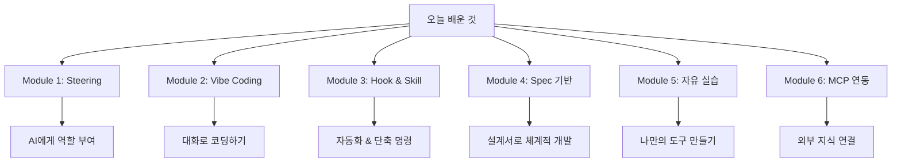

# 마무리

> ⏱️ 10분

## 🎉 축하합니다!

오늘 워크샵을 통해 여러분은:

| 배운 것 | 만든 것 |
|---------|---------|
| ✅ AI에게 역할 부여 (Steering) | 뷰티 제품 분석 어시스턴트 |
| ✅ 대화로 코딩 (Vibe Coding) | 제품 소개 카드 생성기 |
| ✅ 자동화 (Hook & Skill) | 제품 분석 대시보드, 자동 분류 |
| ✅ 체계적 설계 (Spec) | 경쟁사 비교 분석 도구 (Requirements/Design) |
| ✅ 자유 실습 | 나만의 뷰티 업무 도구 |
| ✅ 외부 연결 (MCP) | 실시간 웹 검색 AI |



> 💪 코딩을 한 줄도 직접 쓰지 않고, **말로 설명해서** 이 모든 걸 만들었습니다!

---

## 🔮 이것이 NPL 프로젝트에서는...

오늘 배운 기술들이 앞으로 LG생활건강 NPL(신제품 출시) 시스템에 어떻게 적용되는지 보여드리겠습니다:

| 오늘 배운 것 | NPL 프로젝트 적용 |
|-------------|-------------------|
| **Steering** | NPL 챗봇이 마케터의 업무 맥락을 이해하는 원리 |
| **Vibe Coding** | 필수값 입력 → 5대 Report가 자동 생성되는 원리 |
| **Hook** | 데이터 업데이트 시 Report가 자동 갱신되는 원리 |
| **Skill** | 복잡한 분석을 한 명령으로 실행하는 원리 |
| **Spec** | 복잡한 NPL 프로세스를 단계별로 AI에게 지시하는 원리 |
| **MCP** | AI가 PLM/DW 같은 내부 시스템에 접근하는 원리 |

### NPL Pre-Start 프로세스 자동화

```
현재 (수작업)
━━━━━━━━━━━━━
마케터가 직접 5대 Report의 수십 개 항목을 하나씩 작성
→ 수일~수주 소요

미래 (AI 자동화)
━━━━━━━━━━━━━━━
1. 챗봇으로 필수값 입력 (Brand, Format, Ambition 등)
2. AI가 내부 DB(PLM, DW) 자동 조회 (MCP)
3. 시장 데이터 자동 분석 (Hook + Skill)
4. 5대 Report 초안 자동 생성 (Spec 기반)
→ 수분~수시간으로 단축!
```

### 5대 Report 자동화 연결

| Report | AI 활용 방식 |
|--------|-------------|
| 1. Strategic Fit | 필수값 입력 → AI가 포지셔닝 요약 생성 |
| 2. Market Opportunity | 크롤링 데이터 + AI 분석 → 시장 인사이트 자동 정리 |
| 3. Insight & Concept | 타겟 정보 기반 → Concept Statement 자동 생성 |
| 4. Scope & Resource | 내부 DB 조회 → 가격/채널/일정 자동 정리 |
| 5. Project Management | 일정 입력 → 타임라인 + 체크리스트 자동 생성 |

---

## 📌 오늘의 핵심 메시지

> 🎯 **"AI는 도구이고, 여러분이 감독입니다."**
>
> - AI가 코드를 쓰지만, **무엇을 만들지 결정하는 건 여러분**
> - AI가 분석하지만, **인사이트를 뽑는 건 여러분**
> - AI가 자동화하지만, **방향을 정하는 건 여러분**

---

## 🛠️ 이후 활용 팁

### Kiro를 업무에 바로 쓰려면

1. **간단한 것부터**: 엑셀 정리, 보고서 양식 같은 단순 작업
2. **Steering 활용**: 자기 업무에 맞는 역할 설정
3. **반복 작업 자동화**: 매주 하는 보고서 → Skill로 등록
4. **팀원과 공유**: 만든 도구를 HTML로 공유

### 추천 학습 경로

```
오늘의 워크샵 (기초)
    ↓
Kiro 공식 문서 (심화)
    ↓
자기 업무에 적용 (실전)
    ↓
팀 내 전파 (확산)
```

---

## 🚀 더 배우고 싶다면

| 자료 | 링크 |
|------|------|
| Kiro 공식 문서 | [kiro.dev/docs](https://kiro.dev/docs) |
| Kiro FAQ | [kiro.dev/faq](https://kiro.dev/faq/) |
| Kiro GitHub | [github.com/kirodotdev/Kiro](https://github.com/kirodotdev/Kiro) |

---

## 📊 워크샵 피드백

오늘 워크샵은 어떠셨나요? 솔직한 피드백을 부탁드립니다! 🙏

- 가장 재미있었던 부분은?
- 어려웠던 부분은?
- 실무에서 활용하고 싶은 것은?
- 개선할 점은?

---

## ❓ Q&A

궁금한 점이 있으시면 자유롭게 질문해주세요!

### 자주 묻는 질문

**Q: Kiro는 무료인가요?**
> 현재 무료로 사용 가능합니다. (향후 변경 가능)

**Q: 인터넷 없이도 쓸 수 있나요?**
> AI 기능은 인터넷이 필요합니다. 하지만 만들어진 HTML 파일은 오프라인에서도 동작합니다.

**Q: 회사 데이터를 넣어도 안전한가요?**
> 민감한 데이터는 넣지 않는 것을 권장합니다. 테스트용 가상 데이터를 활용하세요.

**Q: 오늘 만든 파일을 다른 사람에게 공유할 수 있나요?**
> 네! HTML 파일 자체를 메일이나 메신저로 공유하면 됩니다. 상대방은 브라우저만 있으면 OK.

---

## 🙏 감사합니다!

오늘 함께해주셔서 감사합니다.

> 💬 "오늘 배운 AI 도구로, 내일의 업무를 더 스마트하게!" 🚀
